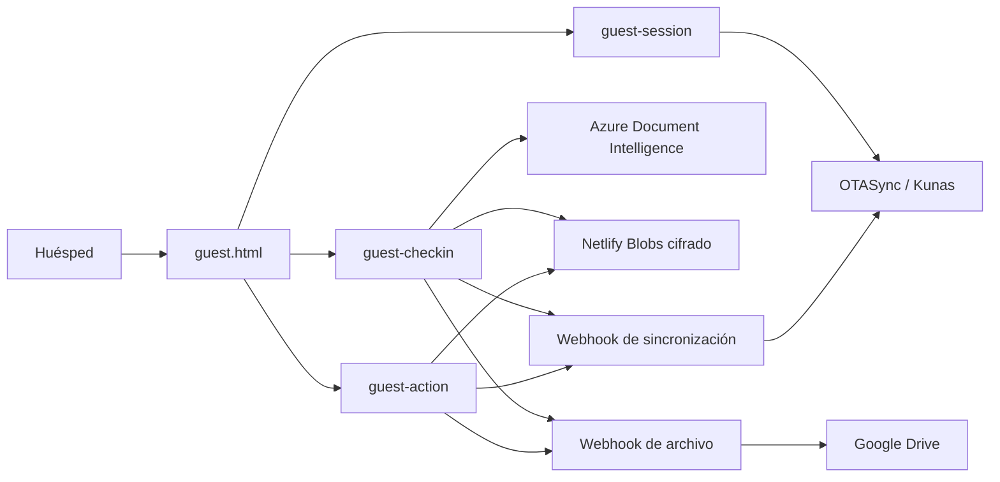

# Guest app de Estar

## Alcance implementado

La primera versión vive en `guest.html` y cubre:

- Acceso con código de reserva + apellido del titular.
- Sesión temporal firmada, sin exponer credenciales de OTASync/Kunas.
- Consulta y resumen de la reserva.
- Pre check-in con carga de documento (galería **o cámara guiada en vivo**) y
  **gate de 3 intentos → verificación manual**.
- Lectura opcional con Azure AI Document Intelligence.
- Validación de campos requeridos y documento vencido.
- **Captura de datos SIRE/TRA** (género, ocupación, residencia, procedencia,
  destino) + **consentimiento de marketing** (opt-in Ley 1581).
- Firma electrónica simple del contrato (ver `docs/firma-electronica-colombia.md`).
- Catálogo y pedido de servicios adicionales, con **pago en línea** (Wompi o
  Mercado Pago) o cargo a la cuenta (folio Kunas).
- Concierge con recomendaciones, preguntas frecuentes y solicitudes.
- Solicitudes de cambio, factura o cancelación (pueden abrir ticket en Odoo
  Helpdesk, gateado por `HELPDESK_ENABLED`).
- Persistencia cifrada de eventos en Netlify Blobs.
- Adaptadores webhook para sincronizar con OTASync/Kunas y archivar en Google Drive.

## Flujo de integración



## Variables requeridas

Las variables están documentadas en `.env.example`.

Producción requiere como mínimo:

- `OTASYNC_TOKEN`
- `OTASYNC_USERNAME`
- `OTASYNC_PASSWORD`
- `OTASYNC_PROPERTY_ID`
- `GUEST_APP_TOKEN_SECRET`
- `GUEST_APP_DATA_ENCRYPTION_KEY`

Para OCR:

- `AZURE_DOCUMENT_INTELLIGENCE_ENDPOINT`
- `AZURE_DOCUMENT_INTELLIGENCE_KEY`
- `AZURE_DOCUMENT_INTELLIGENCE_MODEL_ID=prebuilt-idDocument`
- `AZURE_DOCUMENT_INTELLIGENCE_API_VERSION=2024-11-30`

Para archivo y sincronización:

- `GUEST_APP_SYNC_WEBHOOK_URL`
- `GUEST_APP_SYNC_WEBHOOK_SECRET`
- `GUEST_APP_DRIVE_WEBHOOK_URL`
- `GUEST_APP_DRIVE_WEBHOOK_SECRET`

El webhook de Drive puede ser un pequeño servicio, Make, n8n o Google Apps Script. Debe recibir el documento, crear una carpeta por reserva y devolver/registrar los enlaces de Drive.

El webhook interno de sincronización ya está incluido en `guest-sync.js`. En producción se configura como:

```env
GUEST_APP_SYNC_WEBHOOK_URL=https://estar.com.co/api/guest-sync
```

Actualmente valida el secreto, guarda el evento cifrado y notifica al equipo. La escritura directa de huéspedes, extras y facturas en OTASync queda pendiente hasta confirmar con OTASync los cuerpos de sus endpoints privados.

## Configuración de Google Drive

La integración usa dos pasos para no exponer el Apps Script ni sus credenciales al navegador:

1. `guest-checkin` y `guest-action` envían el archivo a `https://estar.com.co/api/guest-drive`.
2. `guest-drive.js` valida `GUEST_APP_DRIVE_WEBHOOK_SECRET` y reenvía el contenido al Apps Script.
3. El Apps Script valida un segundo secreto y crea carpetas, documentos y contratos PDF en Drive.

El código y la guía de instalación están en `integrations/google-drive-apps-script/`.

Variables adicionales:

- `GOOGLE_DRIVE_APPS_SCRIPT_URL`
- `GOOGLE_DRIVE_APPS_SCRIPT_SECRET`

El ID de la carpeta raíz no se guarda en Netlify. Se configura como propiedad `ROOT_FOLDER_ID` dentro del proyecto de Google Apps Script.

## Decisiones importantes

- Los documentos no se guardan temporalmente en Blobs salvo que `GUEST_APP_STORE_DOCUMENTS=true`.
- Los registros de check-in, contrato y pedidos se cifran con AES-256-GCM antes de guardarse.
- Los cambios y cancelaciones se crean como solicitudes. No se modifica automáticamente una reserva originada en una OTA sin confirmar primero las reglas del canal.
- Los precios de servicios se recalculan en el servidor para evitar manipulación desde el navegador.
- OTASync ya ofrece un módulo Guest App nativo. Puede activarse como alternativa rápida o usarse como backend mientras Estar conserva esta experiencia de marca.

## Siguiente fase recomendada

1. Confirmar los endpoints privados de OTASync para actualizar huésped, adjuntar documento y **empujar los datos SIRE/TRA** ya capturados (ver `docs/pendientes.md` §2). Para extras al folio ya existe `_otasync.postOrderExtrasToFolio` (gateado).
2. Elegir proveedor de firma con evidencia legal si el contrato requiere una firma avanzada.
3. Crear el servicio de archivo en Drive con carpetas y permisos restringidos.
4. ~~Conectar pagos de servicios con Wompi.~~ **Hecho** (Wompi + Mercado Pago en pedidos en línea; cargo al folio Kunas gateado por `GUEST_SERVICE_FOLIO_ENABLED`).
5. Añadir enlaces únicos por reserva enviados por correo y WhatsApp.
6. Mostrar llaves digitales o códigos de acceso solo después del check-in validado — base construida con **TTLock** (`_ttlock.js`, `TTLOCK_*`, apagado).
7. Incorporar chat, estado de pedidos, encuestas durante la estancia y recuperación de objetos olvidados.

## Referencias

- Azure Document Intelligence ID model: https://learn.microsoft.com/en-us/azure/ai-services/document-intelligence/prebuilt/id-document
- Azure REST API `2024-11-30`: https://learn.microsoft.com/en-us/rest/api/aiservices/document-models/analyze-document-from-stream
- OTASync Guest App: https://helpdesk.otasync.me/en/articles/8100063-our-guest-app-and-everything-you-need-to-know-about-it
