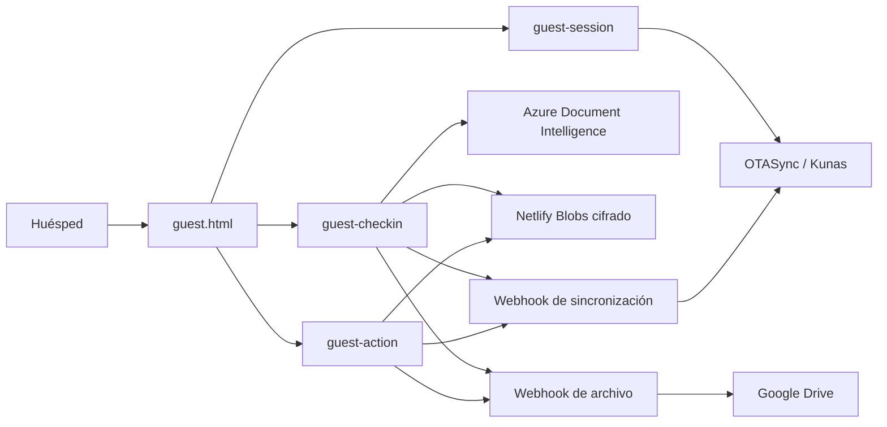

# Guest app de Estar

## Alcance implementado

La primera versión vive en `guest.html` y cubre:

- Acceso con código de reserva + apellido del titular.
- Sesión temporal firmada, sin exponer credenciales de OTASync/Kunas.
- Consulta y resumen de la reserva.
- Pre check-in con carga de documento (galería **o cámara guiada en vivo**) y
  **gate de 3 intentos → verificación manual**.
- Lectura opcional con Azure AI Document Intelligence.
- Validación de campos requeridos y documento vencido.
- **Captura de datos SIRE/TRA** (género, ocupación, residencia, procedencia,
  destino) + **consentimiento de marketing** (opt-in Ley 1581).
- Firma electrónica simple del contrato (ver `docs/firma-electronica-colombia.md`)
  y sección "Contrato" abajo.
- Catálogo y pedido de servicios adicionales, con **pago en línea** (Wompi o
  Mercado Pago) o cargo a la cuenta (folio Kunas). "Pagar en línea" solo se
  ofrece si `GUEST_SERVICE_PAYMENT_MODE` lo soporta (la sesión trae
  `booking.onlinePayment`); con `room_charge` solo aparece "Cargar a mi cuenta".
- **Versión en inglés** en `/en/guest.html`, generada por `build.js`
  (`build-guest-en.js`) desde el `guest.html` bilingüe (`.lang-es`/`.lang-en`)
  + `i18n/guest.{es,en}.json`. Los errores del servidor llevan un `code` estable
  y la app los traduce (nunca muestra "Payload too large" ni similares).
- Reservas **canceladas** no abren la app (`guest-session` → 403
  `booking_cancelled`).
- Documento: cámara guiada en el celular; en computador (o si la cámara no abre)
  botón visible **Subir archivo** (las imágenes se reescalan antes de enviarse).
- Validación en el cliente alineada con el servidor: destino al salir para
  extranjeros, y a los **menores** no se les exige correo/WhatsApp/aceptación.
- Cupos de uso separados: leer documentos (`guest-checkin-analyze`, 24/10 min) y
  enviar el check-in (`guest-checkin-submit`, 10/10 min).
- El opt-in de marketing del check-in llega a Odoo (partner con etiqueta
  `Opt-in marketing` + lista `Newsletter`), solo con consentimiento.
- Concierge con recomendaciones, preguntas frecuentes y solicitudes.
- Solicitudes de cambio, factura o cancelación (pueden abrir ticket en Odoo
  Helpdesk, gateado por `HELPDESK_ENABLED`).
- Persistencia cifrada de eventos en Netlify Blobs.
- Adaptadores webhook para sincronizar con OTASync/Kunas y archivar en Google Drive.

## Flujo de integración


```mermaid
flowchart LR
  Guest["Huésped"] --> App["guest.html"]
  App --> Session["guest-session"]
  Session --> OTA["OTASync / Kunas"]
  App --> Checkin["guest-checkin"]
  Checkin --> Azure["Azure Document Intelligence"]
  Checkin --> Blobs["Netlify Blobs cifrado"]
  Checkin --> Sync["Webhook de sincronización"]
  Sync --> OTA
  Checkin --> Drive["Webhook de archivo"]
  Drive --> GoogleDrive["Google Drive"]
  App --> Actions["guest-action"]
  Actions --> Blobs
  Actions --> Sync
  Actions --> Drive
```

## Variables requeridas

Las variables están documentadas en `.env.example`.

Producción requiere como mínimo:

- `OTASYNC_TOKEN`
- `OTASYNC_USERNAME`
- `OTASYNC_PASSWORD`
- `OTASYNC_PROPERTY_ID`
- `GUEST_APP_TOKEN_SECRET`
- `GUEST_APP_DATA_ENCRYPTION_KEY`

Para OCR:

- `AZURE_DOCUMENT_INTELLIGENCE_ENDPOINT`
- `AZURE_DOCUMENT_INTELLIGENCE_KEY`
- `AZURE_DOCUMENT_INTELLIGENCE_MODEL_ID=prebuilt-idDocument`
- `AZURE_DOCUMENT_INTELLIGENCE_API_VERSION=2024-11-30`

Para archivo y sincronización:

- `GUEST_APP_SYNC_WEBHOOK_URL`
- `GUEST_APP_SYNC_WEBHOOK_SECRET`
- `GUEST_APP_DRIVE_WEBHOOK_URL`
- `GUEST_APP_DRIVE_WEBHOOK_SECRET`

El webhook de Drive puede ser un pequeño servicio, Make, n8n o Google Apps Script. Debe recibir el documento, crear una carpeta por reserva y devolver/registrar los enlaces de Drive.

El webhook interno de sincronización ya está incluido en `guest-sync.js`. En producción se configura como:

```env
GUEST_APP_SYNC_WEBHOOK_URL=https://estar.com.co/api/guest-sync
```

Actualmente valida el secreto, guarda el evento cifrado y notifica al equipo. La escritura directa de huéspedes, extras y facturas en OTASync queda pendiente hasta confirmar con OTASync los cuerpos de sus endpoints privados.

## Configuración de Google Drive

La integración usa dos pasos para no exponer el Apps Script ni sus credenciales al navegador:

1. `guest-checkin` y `guest-action` envían el archivo a `https://estar.com.co/api/guest-drive`.
2. `guest-drive.js` valida `GUEST_APP_DRIVE_WEBHOOK_SECRET` y reenvía el contenido al Apps Script.
3. El Apps Script valida un segundo secreto y crea carpetas, documentos y contratos PDF en Drive.

El código y la guía de instalación están en `integrations/google-drive-apps-script/`.

Variables adicionales:

- `GOOGLE_DRIVE_APPS_SCRIPT_URL`
- `GOOGLE_DRIVE_APPS_SCRIPT_SECRET`

El ID de la carpeta raíz no se guarda en Netlify. Se configura como propiedad `ROOT_FOLDER_ID` dentro del proyecto de Google Apps Script.

## Contrato de hospedaje

1. Se ve y se firma **después del check-in**. `guest-checkin` guarda el
   expediente y un índice reserva → check-in (`guest-checkin-index`, sin PII);
   `guest-action` arma el contrato con los huéspedes de ese check-in y con los
   datos firmados en el token (fechas, apartaestudio, total), no con lo que
   mande el navegador.
2. `contract_preview` devuelve el HTML exacto que el huésped lee y su SHA-256.
   El render es determinista (sin hora actual: "Pendiente de firma").
3. Al firmar, el navegador envía ese hash (`previewHash`); el servidor vuelve a
   renderizar el mismo documento y exige que coincida (si no, 409
   `contract_changed` y se pide leerlo de nuevo). El `contractHash` guardado es
   el del texto leído (`contractHashScope: preview-html-masked`); el render con
   datos completos queda en `fullContractHash`.
4. Se genera el PDF con `_pdf-render` (ES/EN, cláusulas de
   `_contract-template`, bloque de evidencia con la huella), se guarda su SHA-256
   (`pdfSha256`), se ofrece para descargar y se envía una copia al correo del
   huésped (`_email.contractCopyHtml`, best-effort).
5. "Descargar PDF" en la vista previa genera un **borrador** en el servidor.
6. **Protección de datos:** la vista previa (HTML y borrador PDF) muestra los
   documentos, el teléfono y el correo **enmascarados** (`••••1234`,
   `m•••@dominio`): una sesión solo exige código + apellido. Los datos completos
   solo van en el PDF firmado que se envía al correo del check-in. La vista
   previa y la firma solo existen hasta el check-out + 1 día (403
   `contract_window_closed`) y, una vez firmado, se rechazan (409
   `contract_already_signed`, índice sin PII `guest-contract-index`).
7. **Reserva cancelada después de entrar:** el token dura 24 h, así que el envío
   del check-in, la vista previa/firma del contrato y los pedidos de servicios
   vuelven a consultar la reserva en OTASync (`_guest-app.assertBookingActive`)
   y responden 403 `booking_cancelled` si fue cancelada (si OTASync no responde
   se deja pasar).

## Decisiones importantes

- Los documentos no se guardan temporalmente en Blobs salvo que `GUEST_APP_STORE_DOCUMENTS=true`.
- Los registros de check-in, contrato y pedidos se cifran con AES-256-GCM antes de guardarse.
- Los cambios y cancelaciones se crean como solicitudes. No se modifica automáticamente una reserva originada en una OTA sin confirmar primero las reglas del canal.
- Los precios de servicios se recalculan en el servidor para evitar manipulación desde el navegador.
- OTASync ya ofrece un módulo Guest App nativo. Puede activarse como alternativa rápida o usarse como backend mientras Estar conserva esta experiencia de marca.

## Siguiente fase recomendada

1. Confirmar los endpoints privados de OTASync para actualizar huésped, adjuntar documento y **empujar los datos SIRE/TRA** ya capturados (ver `docs/pendientes.md` §2). Para extras al folio ya existe `_otasync.postOrderExtrasToFolio` (gateado).
2. Elegir proveedor de firma con evidencia legal si el contrato requiere una firma avanzada.
3. Crear el servicio de archivo en Drive con carpetas y permisos restringidos.
4. ~~Conectar pagos de servicios con Wompi.~~ **Hecho** (Wompi + Mercado Pago en pedidos en línea; cargo al folio Kunas gateado por `GUEST_SERVICE_FOLIO_ENABLED`).
5. Añadir enlaces únicos por reserva enviados por correo y WhatsApp.
6. Mostrar llaves digitales o códigos de acceso solo después del check-in validado — base construida con **TTLock** (`_ttlock.js`, `TTLOCK_*`, apagado).
7. Incorporar chat, estado de pedidos, encuestas durante la estancia y recuperación de objetos olvidados.

## Referencias

- Azure Document Intelligence ID model: https://learn.microsoft.com/en-us/azure/ai-services/document-intelligence/prebuilt/id-document
- Azure REST API `2024-11-30`: https://learn.microsoft.com/en-us/rest/api/aiservices/document-models/analyze-document-from-stream
- OTASync Guest App: https://helpdesk.otasync.me/en/articles/8100063-our-guest-app-and-everything-you-need-to-know-about-it
